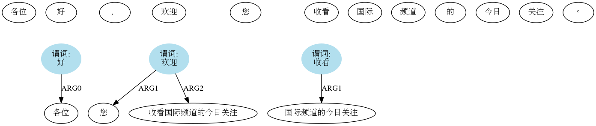
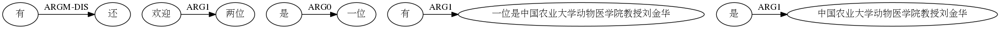
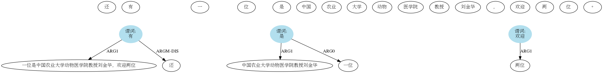

## semantic role labeling

[更多资料可看](https://geasyheart.github.io/2021/11/12/bio-based%E8%AF%AD%E4%B9%89%E8%A7%92%E8%89%B2%E6%A0%87%E6%B3%A8/)

## 以下图片解释

第一行表示`分词`
第二行为所有`谓词`
第三行为`谓词`和`论元`的关系

真实：

预测：

真实：

预测：

